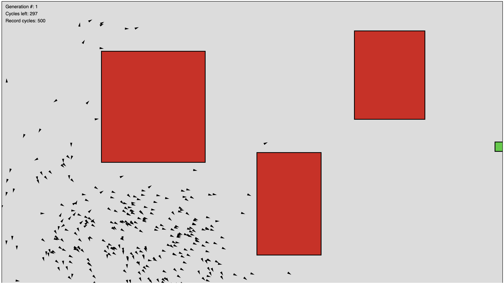

## Project Description – Varun Purushothaman

The project focuses on the artificial intelligence of drones whose goal is to travel across the stage and reach the end goal. However, obstacles can be drawn in at any time. Using a genetic algorithim, the drones can adapt and overcome obstacles to reach their end goal. This program is written in JavaScript and based off the book The Nature of Code by Daniel Shiffman.

### Drones in Action

After drawing a couple of obstacles, we can wait for a couple generations and watch our drones take action!

### Thank you!
